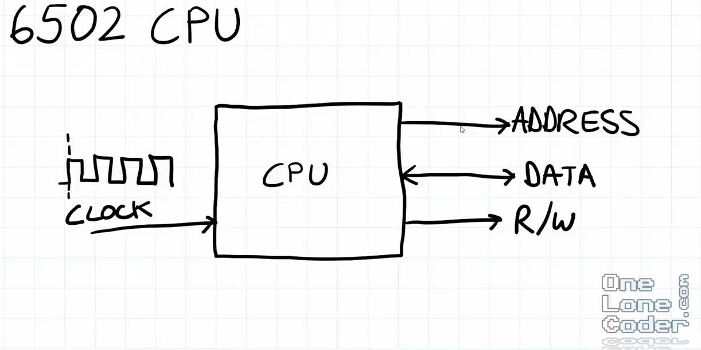
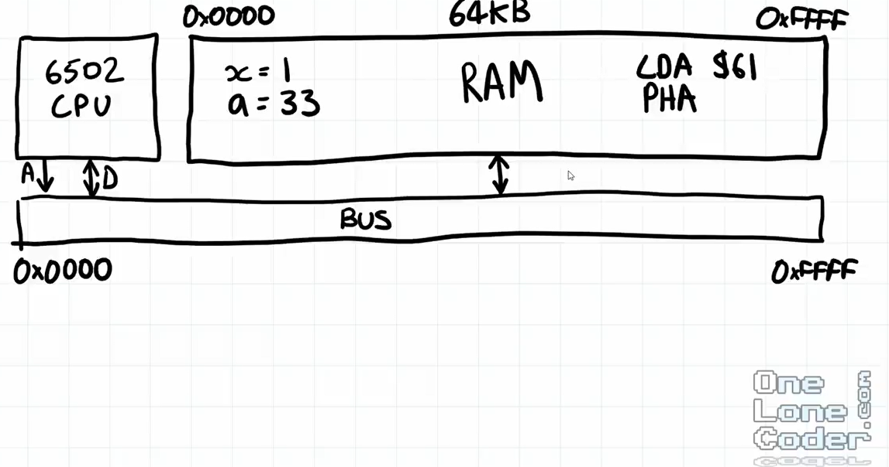
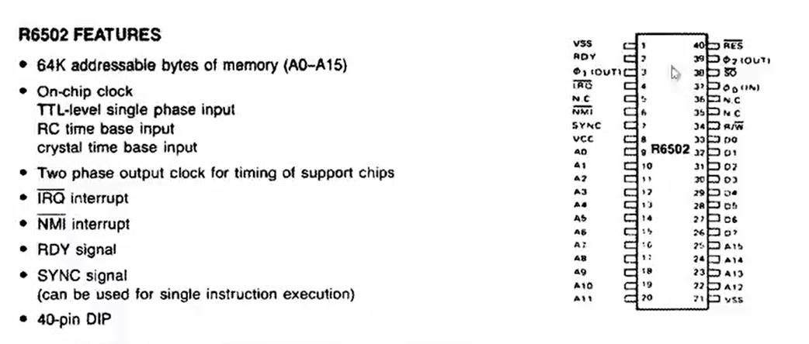
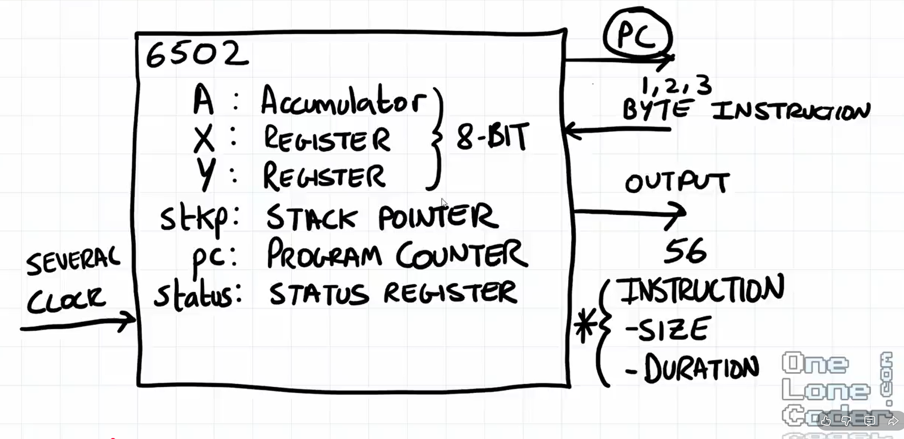
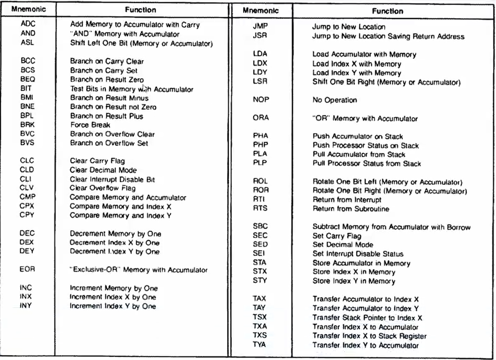
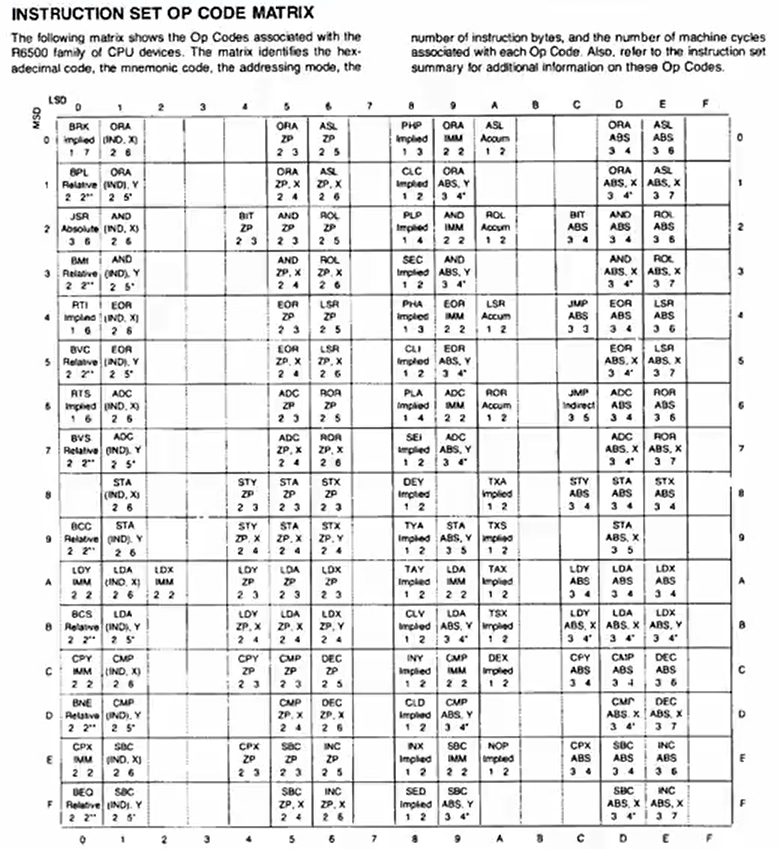

# RustiNESs

A simple Nintendo Entertainment System (NES) emulator written in **Rust**, built for learning and experimentation.

This project aims to incrementally emulate the original NES hardware, starting with the **6502 CPU** and gradually adding the PPU, APU, cartridge mappers, and input devices.

## Devlog

### Day 1: 01.02.2026
- Watch [NES Emulator Part #1: Bitwise Basics & Overview](https://www.youtube.com/watch?v=F8kx56OZQhg)
- Watch [NES Emulator Part #2: The CPU (6502 Implementation)](https://www.youtube.com/watch?v=8XmxKPJDGU0)



- A CPU in isolation does nothing
- CPU (6502) needs to be conntected to a BUS



- Address and data lines of the CPU are connected to the CPU 
- CPU sets address of the BUS - other devices need to react 
- BUS has a 16-bit address space from 0x0000 to 0xFFFF
- Every device gets assigned an address range on the BUS 
- In our system: 64 kB of RAM containing variables as well as the program itself
- The CPU extracts bytes from the RAM in order to execute them 
- We need a CPU, a BUS and a RAM




- 16 address bits: A0-A15
- 8 data bits: D0-D7




- Not all instructions are the same length
- Different instructions need different numbers of clock cycles to execute
- 56 legal instructions
- First byte of the instruction provides us with the length and the duration of the instruction



- The above tables shows the Op Codes of the different instructions
- LDA $41 - we load immediate data and this is a 2-byte instruction
- LDA $0105 - load from memory address and this is a 3-byte instruction
- CLC - 1-byte instruction
- For a given instruction, we need to *emulate its function, its address mode and the number of cycles*



- We can refer to the instructions using a 16x16-table index by 4+4 bits = 1 byte. 
- The first byte read can be used to index the table
- Suppose we index LDA, IMM, 2, 2 - load the accumulator from an immediate data centers, it's a 2-byte instruction (left number) and takes 2 cycles (right number) 
- The blank spaces refer to illegal Op Codes - the CPU will do things but they may be unexpected

- Sequence of events
    - 1) Read byte @ PC
    - 2) The Op Code derived from the byte gives addressing mode and number of cycles
    - 3) Read 0, 1, or 2 more bytes
    - 4) Execute
    - 5) Wait, count cycles, complete


### Day 2: 14.02.2026

- Learn Rust from ChatGPT
- Implement more instructions
- Add Web GUI for debugging 6502 emulator - it is not fully functional yet but accessible via: https://kunkelalexander.github.io/rustiNESs/


### Day 3: 16.02.2026
- Finish implementing CPU instructions
- Wire up Harte's test suite for testing all the operations: https://github.com/SingleStepTests/65x02/tree/main
- `cargo test harte_nes6502_v1_all_opcodes -- --nocapture`
- Fails :/, that's for another day

## Goals

- Learn low-level hardware emulation
- Learn Rust
- Build a reasonably accurate (but readable) NES emulator
- Keep the architecture modular and testable

## Hardware Overview

The NES consists of:
- **CPU**: Ricoh RP2A03 (6502-compatible, no decimal mode)
- **PPU**: Picture Processing Unit (graphics)
- **APU**: Audio Processing Unit
- **Cartridge**: PRG-ROM, CHR-ROM, mapper logic
- **Controllers**

The CPU communicates with all components via a shared **address bus**, **data bus**, and **read/write control**.


## Project Structure

```
src/
├── main.rs    # Entry point
├── cpu.rs     # 6502 core (registers, execution)
```

## CPU (6502)

- 8-bit data bus
- 16-bit address bus
- Little-endian
- No BCD (decimal) mode on the NES variant
- Memory-mapped I/O

Registers:
- A (Accumulator)
- X, Y (Index registers)
- PC (Program Counter)
- SP (Stack Pointer)
- P (Status Flags)


## Building
wasm-pack build --target web --out-dir docs/pkg

## Current Status

- [ ] CPU registers
- [ ] Memory bus
- [ ] Instruction fetch/decode/execute
- [ ] Cycle accuracy
- [ ] PPU
- [ ] APU
- [ ] Input
- [ ] Mapper support


## License

MIT