# RustiNESs

A simple Nintendo Entertainment System (NES) emulator written in **Rust**, built for learning and experimentation.

This project aims to incrementally emulate the original NES hardware, starting with the **6502 CPU** and gradually adding the PPU, APU, cartridge mappers, and input devices.

## Devlog

## Day 10: 12.04.2025
- Hallelujah: `nestest.nes` and `smb.nes` backgrounds are rendered correctly! 

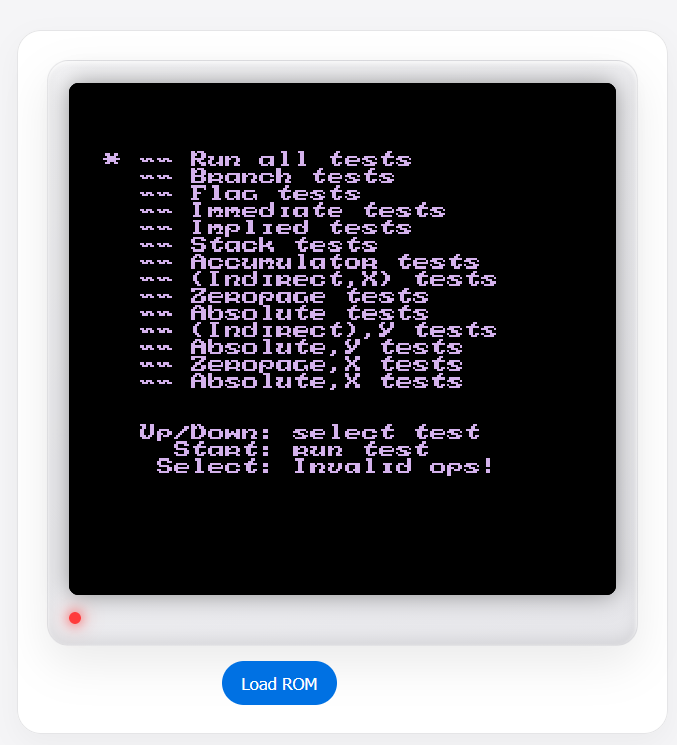
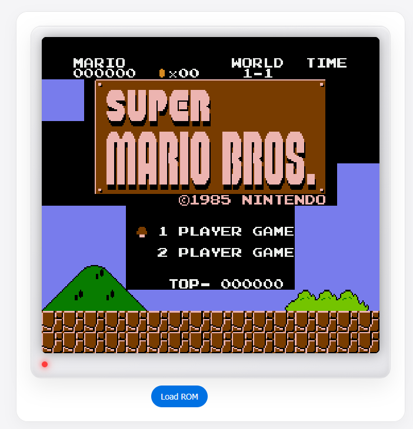

## Day 9: 11.04.2025
- Fix bug in CPU NMI code 
- Load `smb.nes` and show pattern table

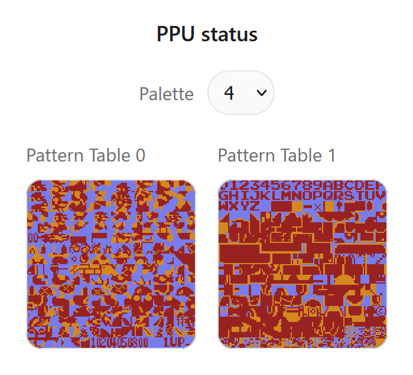

- Background of the game is stored in a nametable - 32 x 32 bytes
- Pattern memory is 16 x 16 tiles -> There are are 256 tiles we can put in a nametable location 
- Each tile is 8x8 pixels, therefore the nametable contains 32x8 x 32x8 = 256 x 256 pixels
- BUT not all rows of the nametable are used and the effective vertical resolution is 240
- In its simplest form, the nametable contains a full vertical screen (e.g. DK)
- SMB needs to scroll via the scroll register of the PPU

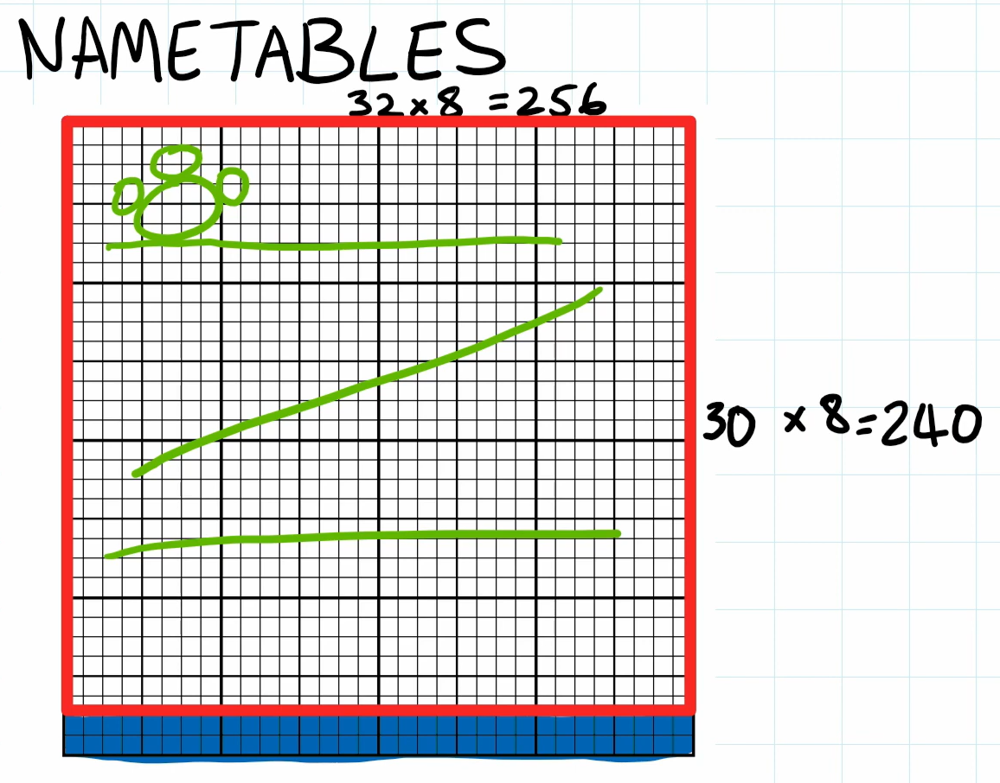

- The NES actually stores two nametables and we render from two nametables at the same time for scrolling with wrapping in two directions 
- Actually, there are 4 nametables via mirroring
- As you are scrolling in a given direction, the CPU needs to update the nametable

- At the bottom of the nametable, there are 64 attribute bytes - we get one byte for every every 8x8 tiles and they specify the palette for every 2x2 tiles


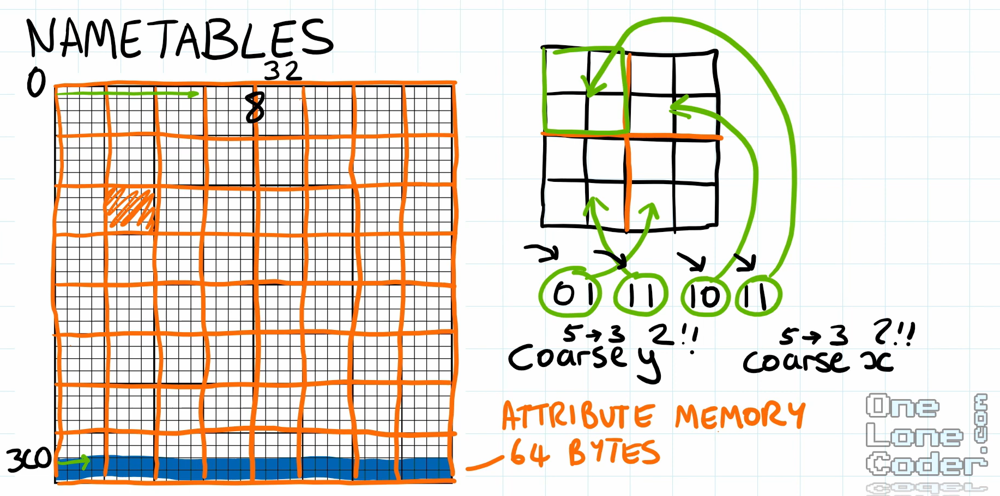

- Let's dive right in: We fill in the PPU code for reading and writing to 0x2000 - 0x2FFF from PPU RAM: In my implementation, the cartridge decides how to map addresses to the name table based on the mirror flag. We can output the first nametable for the nestest ROM  as text:

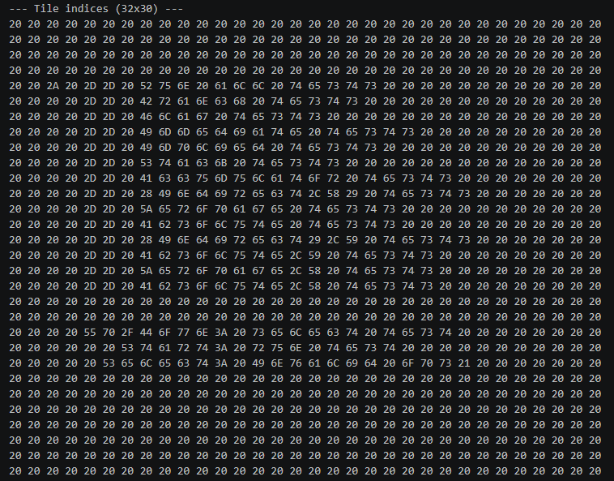

- Very nice - we could actually display the background by choosing the right tiles from the palette but I would like to implement the whole thing first
- To get things to render properly, we need to count scanlines and cycles which is where [this handy diagram](https://www.nesdev.org/w/images/default/4/4f/Ppu.svg) from nesdev comes in

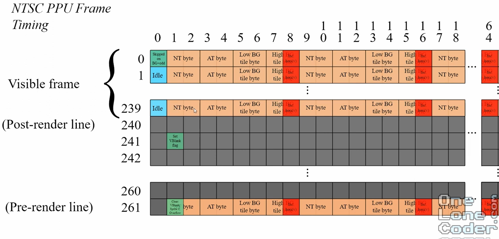


- 8 cycles represent 1 row of one tile
- During thoses 8 cycles, it loads the next 8 bytes for the next 8 cycles: It loads one nametable byte, one attribute byte and the pattern itself (2 bytes)
- This repeats for the 256 visible pixels and then we get to the cycles where nothing is rendered (257 - 340)
- Loopy address (named after a wonderful person called loopy): Internal address for the PPU that correlates the scanline position to everything else, explained [here](https://www.nesdev.org/wiki/PPU_scrolling)

## Day 8: 02.04.2026
- Finish pattern table viewer 
- To render stuff, the PPU needs three things: 
    - The pattern data at 0x000-0x1FFF stored in CHR (ROM or RAM) that defines whether a pixel is 0, 1, 2 or 3 
    - The nametables which says which tiles go where at 0x2000 - 0x2FFF from PPU RAM
    - The palette which stores what the colour indices 0, 1, 2, 3 actually mean stored at 0x3F00-0x3F1F in PPU palette RAM
- The pattern data can be in the ROM file (CHR banks > 0). The PPU reads it directly from the cartridge. This is fast and many simple games use it, but the CPU cannot modify pattern data. 
- the pattern memory can also be empty RAM and the CPU must upload graphics manually in that case - the CPU writes to $2006/2007 and then writes to PPU pattern RAM, this happens every frame during VBlank
- Load `nestest.nes` from [Nesdev.org](https://www.nesdev.org/wiki/Emulator_tests) and show pattern table
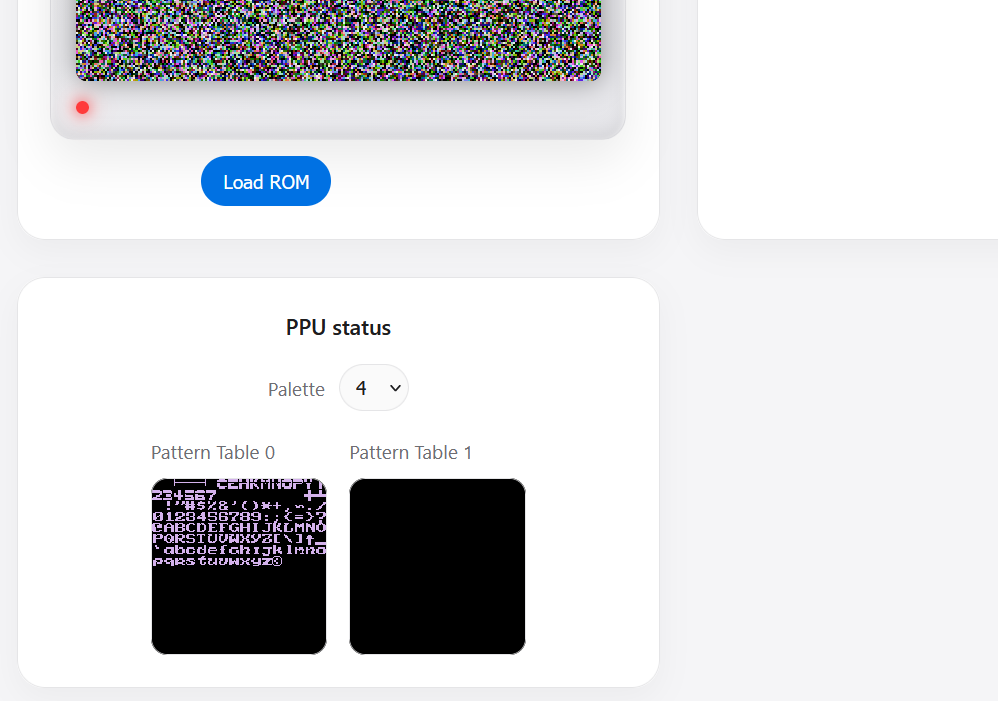

## Day 7: 07.03.2026

- Watch [NES Emulator Part #4: PPU - Background Rendering](https://www.youtube.com/watch?v=-THeUXqR3zY)

- PPU has access to three memories 
- 8 KB pattern memory for sprites stored as bitmaps
- 4 KB nametable containing the layout 
- 1 KG palette for colours

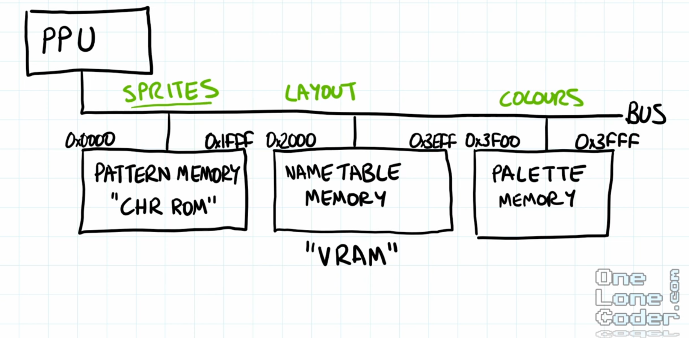

- 8 KB pattern memory is split into 4 KB sections
- They are split into 16x16 tiles
- Each tile is 8x8 pixels
- So each section is a 128x128 image 
- We go via the mapper to access the pattern memory
- The pattern can switch between sections for animations. 

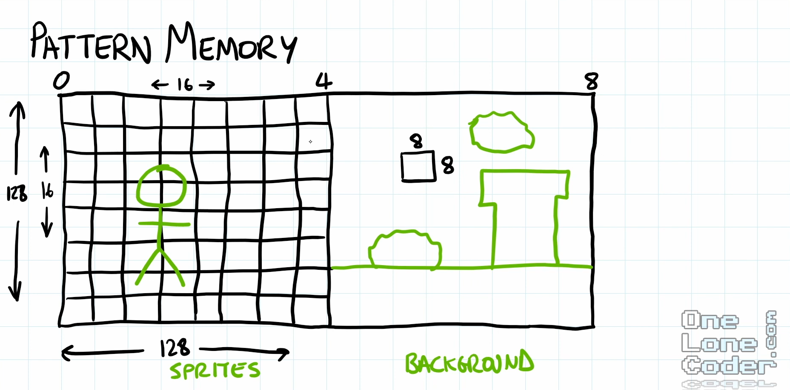

- A tile is an 8x8 bitmap where each bit is actually represented by 2 bits = 4 colours
- There are actually two bitplanes - the least-significant bit plane and the most-significant bit plane
- They can be indexed with 

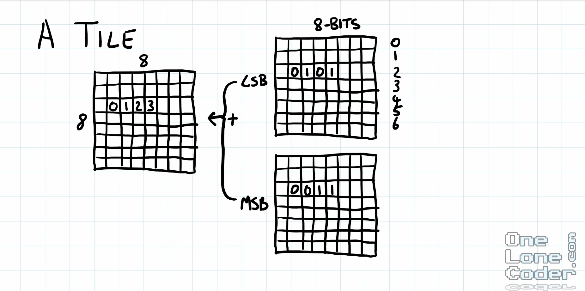

- The palette can be indexed efficiently, every row has three colours + transparent

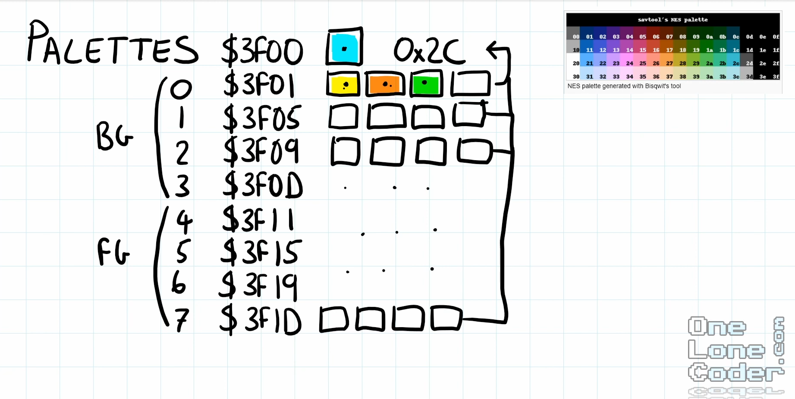

- CPU talks to the PPU via eight registers, mirrored over a wide address range 

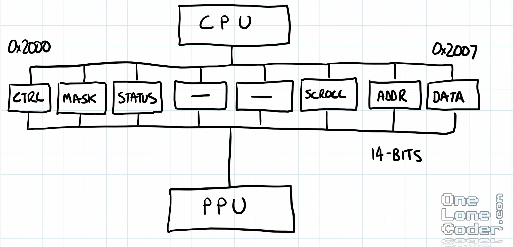

- CPU is setting up the PPU during the vertical blank period 

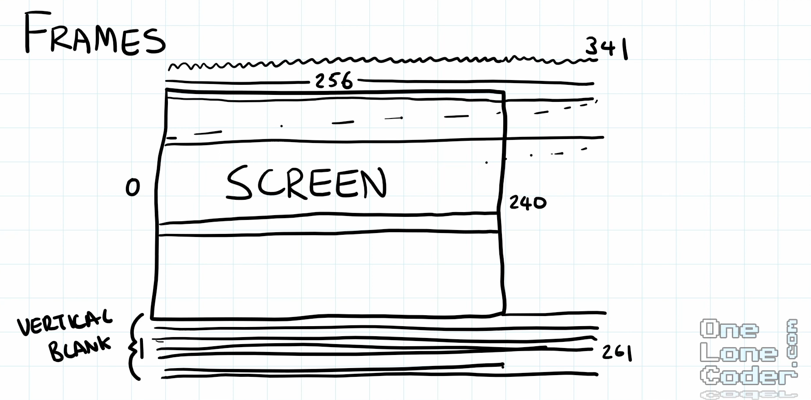

## Day 6: 28.02.2026

- PPU now wired up in the web interface

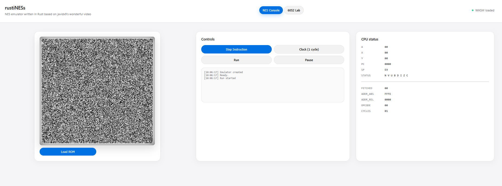

- The hardest bit was for implementing video 3 was to decide how to wire up the different components to reduce dependencies
- In my implementation, the Bus owns the RAM, the PPU and the cartridge, the CPU is by itself and the cartridge owns the mapper

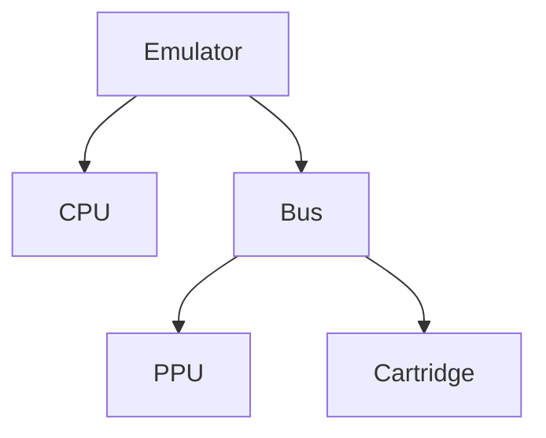
```mermaid
flowchart TD
    Emulator
    CPU
    Bus
    PPU
    Cartridge

    Emulator --> CPU
    Emulator --> Bus
    Bus --> PPU
    Bus --> Cartridge
```

- I decided to implement the [Component pattern](https://gameprogrammingpatterns.com/component.html) via a number of Interfaces that expose the read and write functions of the different NES components

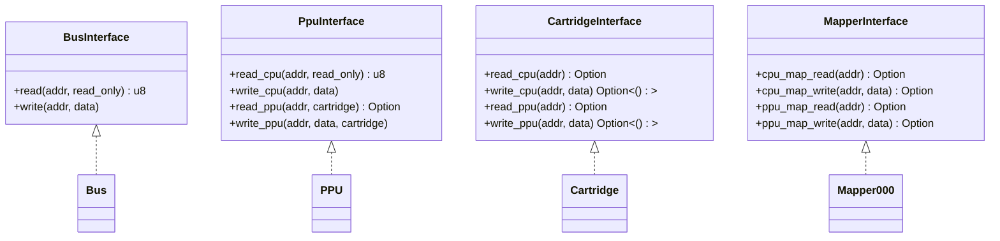
```mermaid
classDiagram

    class BusInterface {
        +read(addr, read_only) u8
        +write(addr, data)
    }

    class PpuInterface {
        +read_cpu(addr, read_only) u8
        +write_cpu(addr, data)
        +read_ppu(addr, cartridge) Option<u8>
        +write_ppu(addr, data, cartridge)
    }

    class CartridgeInterface {
        +read_cpu(addr) Option<u8>
        +write_cpu(addr, data) Option<()>
        +read_ppu(addr) Option<u8>
        +write_ppu(addr, data) Option<()>
    }

    class MapperInterface {
        +cpu_map_read(addr) Option<usize>
        +cpu_map_write(addr, data) Option<usize>
        +ppu_map_read(addr) Option<usize>
        +ppu_map_write(addr, data) Option<usize>
    }

    BusInterface <|.. Bus
    PpuInterface <|.. PPU
    CartridgeInterface <|.. Cartridge
    MapperInterface <|.. Mapper000
```

## Day 5: 23.02.2026
- Watch [NES Emulator Part #3: Buses, RAMs, ROMs & Mappers](https://www.youtube.com/watch?v=xdzOvpYPmGE)

- The RAM has 8 kB of addressable space but actually it's 8 kB mod 2kB - an idea called mirroring

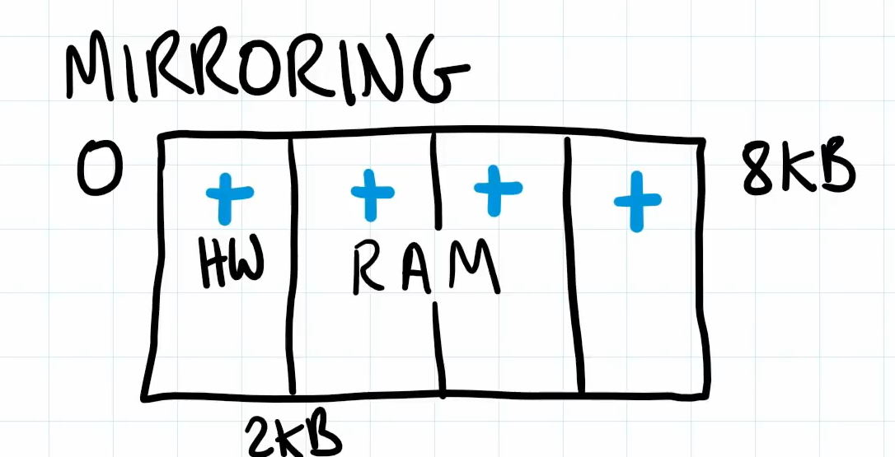

- The modulo operation is expressed via a bit-wise logic and 0x1234 & 0x07ff = 0x0234 which is within the addressable range
- There is more than just the RAM attached to the Bus and the Picture Processing Unit also has its own micro-Bus. Both buses access the cartridge which contains the program ROM, a mapper and patterns

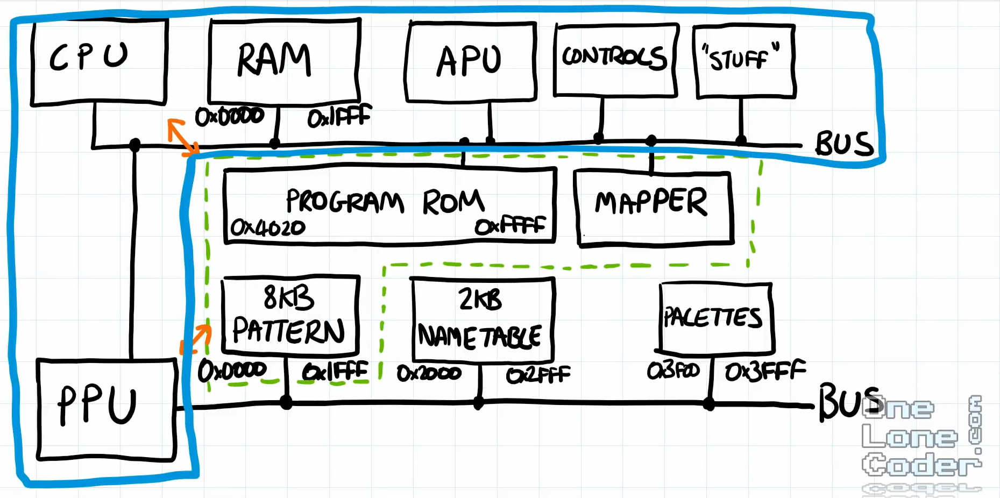

- The cartridge can contain many memory chips and the mapper maps addresses to the right memory location based on how it was configured by the CPU/PPU - This is why there where no loading times, it's just the addresses were mapped differently. 

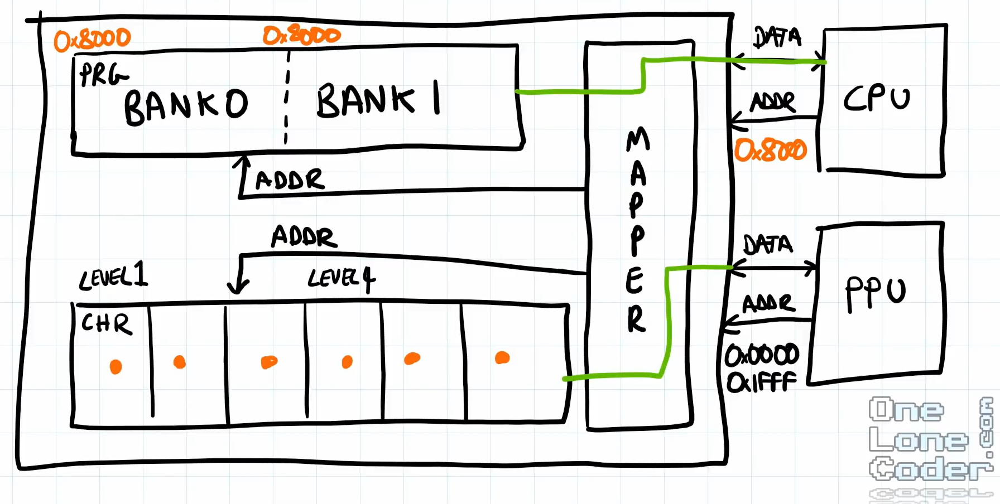

### Day 4: 21.02.2026
- Switch from function pointers in lookup table to match statement with enum to avoid compiler warnings (and I personally also really dislike function pointers from C, I am sure this will also make debugging easier)
- Work on making Harte's test suite pass with help from [Nesdev](https://www.nesdev.org/wiki/Instruction_reference) and ChatGPT
    - It feel really good to see tens of thousands of test cases passing :) 
- All Harte tests for legal operations pass now. I am very happy I chose to test my implementation because I did find a few bugs that would have been annoying to find otherwise. 
- Update web interface to except byte code and to correctly load programs - it can now be used to test the emulator. Next up is Javid9x' second video. 

### Day 3: 16.02.2026
- Finish implementing CPU instructions
- Wire up Harte's test suite for testing all the operations: https://github.com/SingleStepTests/65x02/tree/main
- `cargo test --release -- --nocapture`
- Fails :/, that's for another day


### Day 2: 14.02.2026

- Learn Rust from ChatGPT
- Implement more instructions
- Add Web GUI for debugging 6502 emulator - it is not fully functional yet but accessible via: https://kunkelalexander.github.io/rustiNESs/
    - I decided to compile the rust code using web assembly `wasm-pack build --target web --out-dir docs/pkg` and have ChatGPT write a GUI using JS/CSS/HTML. I really like this solution as it forces me to write a clean Rust interface and does not add unneccessary code to the emulator itself

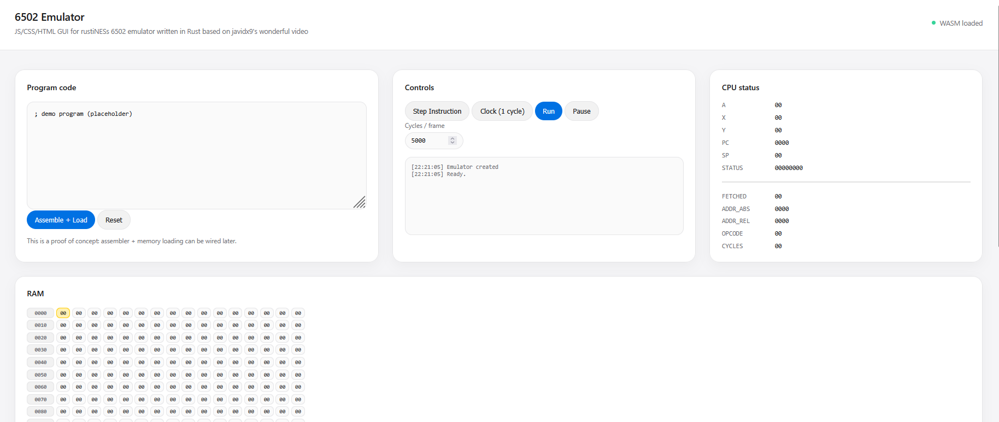

### Day 1: 01.02.2026
- Watch [NES Emulator Part #1: Bitwise Basics & Overview](https://www.youtube.com/watch?v=F8kx56OZQhg)
- Watch [NES Emulator Part #2: The CPU (6502 Implementation)](https://www.youtube.com/watch?v=8XmxKPJDGU0)

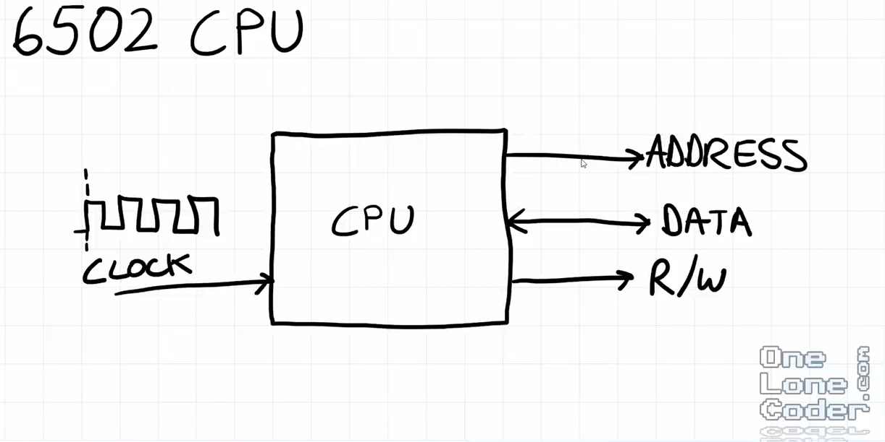

- A CPU in isolation does nothing
- CPU (6502) needs to be conntected to a BUS

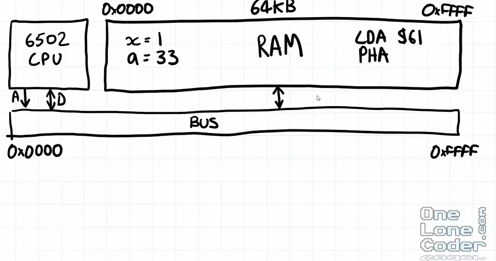

- Address and data lines of the CPU are connected to the CPU 
- CPU sets address of the BUS - other devices need to react 
- BUS has a 16-bit address space from 0x0000 to 0xFFFF
- Every device gets assigned an address range on the BUS 
- In our system: 64 kB of RAM containing variables as well as the program itself
- The CPU extracts bytes from the RAM in order to execute them 
- We need a CPU, a BUS and a RAM


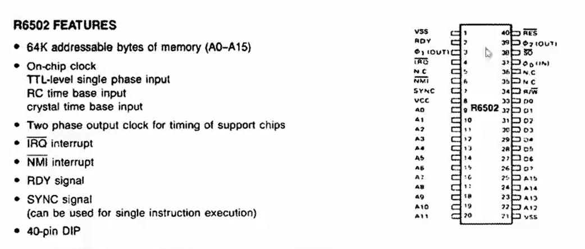

- 16 address bits: A0-A15
- 8 data bits: D0-D7


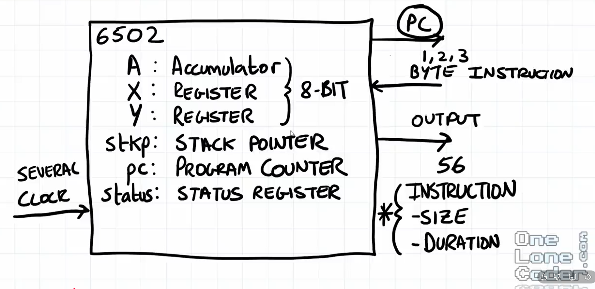

- Not all instructions are the same length
- Different instructions need different numbers of clock cycles to execute
- 56 legal instructions
- First byte of the instruction provides us with the length and the duration of the instruction

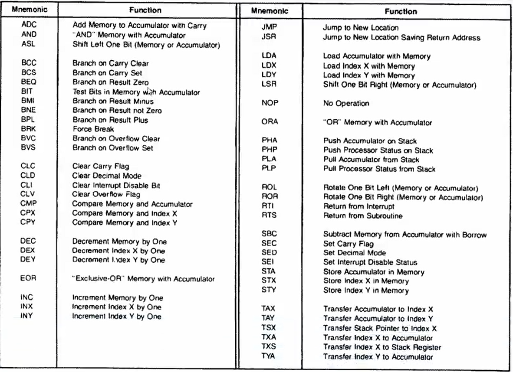

- The above tables shows the Op Codes of the different instructions
- LDA $41 - we load immediate data and this is a 2-byte instruction
- LDA $0105 - load from memory address and this is a 3-byte instruction
- CLC - 1-byte instruction
- For a given instruction, we need to *emulate its function, its address mode and the number of cycles*

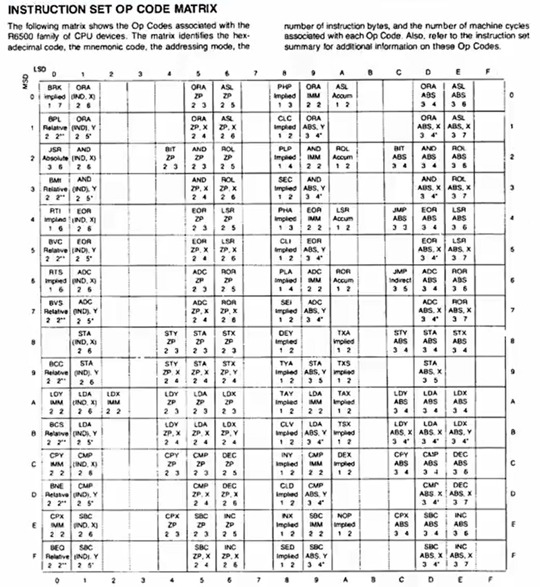

- We can refer to the instructions using a 16x16-table index by 4+4 bits = 1 byte. 
- The first byte read can be used to index the table
- Suppose we index LDA, IMM, 2, 2 - load the accumulator from an immediate data centers, it's a 2-byte instruction (left number) and takes 2 cycles (right number) 
- The blank spaces refer to illegal Op Codes - the CPU will do things but they may be unexpected

- Sequence of events
    - 1) Read byte @ PC
    - 2) The Op Code derived from the byte gives addressing mode and number of cycles
    - 3) Read 0, 1, or 2 more bytes
    - 4) Execute
    - 5) Wait, count cycles, complete


## Goals

- Learn low-level hardware emulation
- Learn Rust
- Build a reasonably accurate (but readable) NES emulator
- Keep the architecture modular and testable

## Project Structure

```
src/
├── main.rs    # Entry point
├── cpu.rs     # 6502 core (registers, execution)
```


## Building

- WASM library for the web application:  `wasm-pack build --target web --out-dir docs/pkg`
- Test with `python -m http.server`
- Tests: `cargo test --release -- --nocapture`
## Current Status

- [x] CPU registers
- [x] Memory bus
- [x] Instruction fetch/decode/execute
- [ ] Cycle accuracy
- [ ] PPU
- [ ] APU
- [ ] Input
- [ ] Mapper support


## License

[MIT](LICENSE)