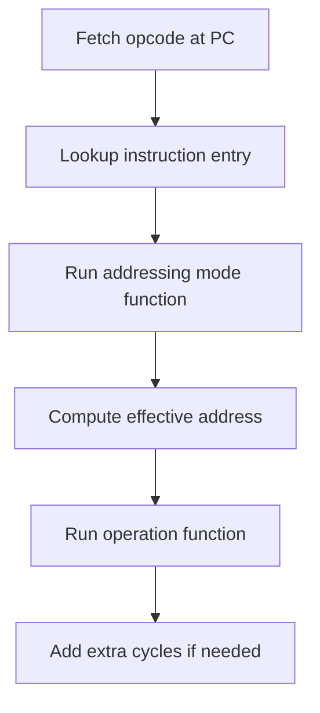

# RustiNESs

A simple Nintendo Entertainment System (NES) emulator written in **Rust**, built for learning and experimentation.

This project aims to incrementally emulate the original NES hardware, starting with the **6502 CPU** and gradually adding the PPU, APU, cartridge mappers, and input devices.

## Devlog

### Day 1: 01.02.2026
- Watch [NES Emulator Part #1: Bitwise Basics & Overview](https://www.youtube.com/watch?v=F8kx56OZQhg)
- Watch [NES Emulator Part #2: The CPU (6502 Implementation)](https://www.youtube.com/watch?v=8XmxKPJDGU0)


- A CPU in isolation does nothing
- CPU (6502) needs to be conntected to a BUS


- Address and data lines of the CPU are connected to the CPU 
- CPU sets address of the BUS - other devices need to react 
- BUS has a 16-bit address space from 0x0000 to 0xFFFF
- Every device gets assigned an address range on the BUS 
- In our system: 64 kB of RAM containing variables as well as the program itself
- The CPU extracts bytes from the RAM in order to execute them 
- We need a CPU, a BUS and a RAM


- 16 address bits: A0-A15
- 8 data bits: D0-D7


- Not all instructions are the same length
- Different instructions need different numbers of clock cycles to execute
- 56 legal instructions
- First byte of the instruction provides us with the length and the duration of the instruction


- The above tables shows the Op Codes of the different instructions
- LDA $41 - we load immediate data and this is a 2-byte instruction
- LDA $0105 - load from memory address and this is a 3-byte instruction
- CLC - 1-byte instruction
- For a given instruction, we need to *emulate its function, its address mode and the number of cycles*


- We can refer to the instructions using a 16x16-table index by 4+4 bits = 1 byte. 
- The first byte read can be used to index the table
- Suppose we index LDA, IMM, 2, 2 - load the accumulator from an immediate data centers, it's a 2-byte instruction (left number) and takes 2 cycles (right number) 
- The blank spaces refer to illegal Op Codes - the CPU will do things but they may be unexpected

- Sequence of events
    - 1) Read byte @ PC
    - 2) The Op Code derived from the byte gives addressing mode and number of cycles
    - 3) Read 0, 1, or 2 more bytes
    - 4) Execute
    - 5) Wait, count cycles, complete


### Day 2: 14.02.2026

- Learn Rust from Chu

## Goals

- Learn low-level hardware emulation
- Learn Rust
- Build a reasonably accurate (but readable) NES emulator
- Keep the architecture modular and testable

## Hardware Overview

The NES consists of:
- **CPU**: Ricoh RP2A03 (6502-compatible, no decimal mode)
- **PPU**: Picture Processing Unit (graphics)
- **APU**: Audio Processing Unit
- **Cartridge**: PRG-ROM, CHR-ROM, mapper logic
- **Controllers**

The CPU communicates with all components via a shared **address bus**, **data bus**, and **read/write control**.


## Project Structure

```
src/
├── main.rs    # Entry point
├── cpu.rs     # 6502 core (registers, execution)
```

## CPU (6502)

- 8-bit data bus
- 16-bit address bus
- Little-endian
- No BCD (decimal) mode on the NES variant
- Memory-mapped I/O

Registers:
- A (Accumulator)
- X, Y (Index registers)
- PC (Program Counter)
- SP (Stack Pointer)
- P (Status Flags)


## Addressing modes
Absolutely — this is a great start, and your comments are already very README-friendly. 🙌
Below is:

1. **A quick code review** (a few important fixes)
2. **A high-level README explanation** (with Mermaid diagrams)

---

## 1) Quick review (important correctness fixes)

### ✅ `imp`, `imm`, `zp0`, `rel`, `abs`, `abx`, `aby`, `ind` are basically correct

### ❌ `zpx` / `zpy` are currently wrong

Right now you do:

```rust
self.addr_abs = self.read(bus, self.pc + self.x as u16) as u16;
self.pc = self.pc.wrapping_add(1);
```

But the 6502 encoding is:

* operand is stored at `PC`
* then you add X/Y to the *operand*, not to the PC

Correct logic is:

```rust
let base = self.read(bus, self.pc) as u16;
self.pc = self.pc.wrapping_add(1);

self.addr_abs = base.wrapping_add(self.x as u16) & 0x00FF;
```

Same for `zpy`.

---

### ❌ `izx` / `izy` are wrong (order and meaning)

These are the trickiest ones.

**Correct 6502 behavior:**

#### `IZX` = Indexed Indirect: `($nn, X)`

1. Read zero-page pointer base `t = mem[PC]`
2. Add X to `t` (wrap in zero page)
3. Read effective address from zero page:

   * lo = mem[(t+X) & 0xFF]
   * hi = mem[(t+X+1) & 0xFF]
4. addr_abs = hi<<8 | lo

**No page-cross cycle is added here.**

---

#### `IZY` = Indirect Indexed: `($nn), Y`

1. Read zero-page pointer base `t = mem[PC]`
2. Read base address from zero page:

   * lo = mem[t]
   * hi = mem[(t+1)&0xFF]
3. addr_abs = base + Y
4. Add extra cycle if page crossed.

---

### ❌ Your `ind` page-bug check is slightly wrong

You wrote:

```rust
if lo == 0x00FF
```

But the bug is triggered when the **pointer low byte** is `0xFF`, i.e.:

```rust
if (ptr & 0x00FF) == 0x00FF
```

(You can still implement it using `lo == 0x00FF` if `lo` is the low byte of the pointer, but in your code `lo` is read from memory and is only 0..255, so it should be `0x00FF`, not `0x00FF` in a u16 context — it’s fine but confusing.)

---

## 2) README explanation (high-level, with Mermaid diagrams)

Here’s a ready-to-paste README section.

---

# 📌 6502 Addressing Modes (High-Level Overview)

The 6502 CPU supports multiple *addressing modes* which define **where an instruction reads/writes its operand**.

Each instruction consists of:

* **Opcode byte** (what to do)
* **0–2 operand bytes** (how to locate data)

Addressing modes are executed *before* the opcode logic, because they:

1. Advance the program counter correctly
2. Compute the effective address (stored in `addr_abs` or `addr_rel`)
3. Sometimes add an extra cycle (e.g. page boundary crossings)

---

## 🧠 Internal CPU fields used

Our implementation uses the classic OLC-style CPU state:

* `pc` — program counter
* `addr_abs` — computed 16-bit effective address
* `addr_rel` — signed 8-bit relative offset (stored as u16)
* `fetched` — cached operand value for some instructions

---

## Execution flow (opcode + addressing mode)



---

# Addressing modes implemented

## 1) Implied (`IMP`)

Used when the operand is implicit (no extra operand bytes).

Examples:

* `CLC`
* `TAX`
* `ASL A`

In our implementation, implied mode also sets:

* `fetched = a`

So accumulator-based instructions can reuse the same `fetch()` logic.

---

## 2) Immediate (`IMM`)

The operand is the next byte in memory.

Example:

```
LDA #$10
```

Machine code:

```
A9 10
```

Immediate mode sets:

* `addr_abs = pc`
* then increments `pc`

So the operation reads directly from that address.

---

## 3) Zero Page (`ZP0`)

Zero page uses an **8-bit address** in the range:

```
0x0000 .. 0x00FF
```

Example:

```
LDA $44
```

Machine code:

```
A5 44
```

Zero page is faster because it uses only one operand byte.

---

## 4) Zero Page + X (`ZPX`) and Zero Page + Y (`ZPY`)

These modes take the zero-page operand byte and add the X or Y register.

Example:

```
LDA $44, X
```

Machine code:

```
B5 44
```

Address calculation wraps around within zero page:

```
(0x00FF + 1) → 0x0000
```

---

## 5) Relative (`REL`)

Relative addressing is used for **branch instructions only**:

* `BEQ`, `BNE`, `BMI`, …

The operand is a signed 8-bit offset relative to `pc`.

Example:

```
BNE -4
```

The CPU sign-extends the offset into `addr_rel`.

Branch instructions later apply:

```
pc = pc + addr_rel
```

---

## 6) Absolute (`ABS`)

Absolute addressing reads a full 16-bit address (little-endian):

```
lo = mem[pc]
hi = mem[pc+1]
addr_abs = (hi << 8) | lo
```

Example:

```
LDA $1234
```

Machine code:

```
AD 34 12
```

---

## 7) Absolute + X (`ABX`) and Absolute + Y (`ABY`)

These modes compute:

```
addr_abs = base + X   (or + Y)
```

They may require an **extra cycle** if adding X/Y crosses a page boundary:

Example:

```
0x12FF + 1 = 0x1300
```

That page crossing is detected using:

```text
(base & 0xFF00) != (addr_abs & 0xFF00)
```

---

## 8) Indirect (`IND`) — used by `JMP`

Indirect addressing is a pointer lookup:

```
JMP ($1234)
```

Machine code:

```
6C 34 12
```

The operand (`$1234`) points to a memory location containing the real jump target.

### The 6502 JMP indirect bug

The original NMOS 6502 has a hardware bug:

```
JMP ($12FF)
```

will read the high byte from `$1200`, not `$1300`.

This is reproduced in our implementation for accuracy.

---

## 9) Indexed Indirect (`IZX`) — `($nn, X)`

This is a two-step pointer lookup:

Example:

```
LDA ($44, X)
```

Machine code:

```
A1 44
```

Steps:

```mermaid
flowchart TD
    A[Read operand byte t = mem[PC]] --> B[t = (t + X) & 0xFF]
    B --> C[lo = mem[t]]
    C --> D[hi = mem[(t+1)&0xFF]]
    D --> E[addr_abs = hi<<8 | lo]
```

This mode always wraps in zero page.

---

## 10) Indirect Indexed (`IZY`) — `($nn), Y`

Example:

```
LDA ($44), Y
```

Machine code:

```
B1 44
```

Steps:

```mermaid
flowchart TD
    A[Read operand byte t = mem[PC]] --> B[lo = mem[t]]
    B --> C[hi = mem[(t+1)&0xFF]]
    C --> D[base = hi<<8 | lo]
    D --> E[addr_abs = base + Y]
    E --> F[Add 1 cycle if page crossed]
```

This mode is the one that commonly triggers the extra cycle due to page crossings.

---

# Summary table

| Mode | Example       | Bytes | Notes                           |
| ---- | ------------- | ----- | ------------------------------- |
| IMP  | `CLC`         | 1     | No operand                      |
| IMM  | `LDA #$10`    | 2     | Operand is next byte            |
| ZP0  | `LDA $44`     | 2     | 0x0000–0x00FF                   |
| ZPX  | `LDA $44,X`   | 2     | Wraps in zero page              |
| ZPY  | `LDX $44,Y`   | 2     | Wraps in zero page              |
| REL  | `BNE label`   | 2     | Signed offset                   |
| ABS  | `LDA $1234`   | 3     | Full 16-bit address             |
| ABX  | `LDA $1234,X` | 3     | +1 cycle if page crossed        |
| ABY  | `LDA $1234,Y` | 3     | +1 cycle if page crossed        |
| IND  | `JMP ($1234)` | 3     | Includes JMP bug                |
| IZX  | `LDA ($44,X)` | 2     | Pointer in zero page            |
| IZY  | `LDA ($44),Y` | 2     | Pointer + Y, page-cross penalty |

---

# Final note: cycle adjustments

Addressing modes return:

* `0` if no extra cycle is needed
* `1` if a page boundary crossing occurred

This allows cycle-correct timing for many instructions.

---

## If you want, I can also:

* rewrite your `zpx/zpy/izx/izy/ind` functions with the corrected behavior, **in your exact style**, so you can paste them directly.


## Building
wasm-pack build --target web --out-dir docs/pkg

## Current Status

- [ ] CPU registers
- [ ] Memory bus
- [ ] Instruction fetch/decode/execute
- [ ] Cycle accuracy
- [ ] PPU
- [ ] APU
- [ ] Input
- [ ] Mapper support


## License

MIT