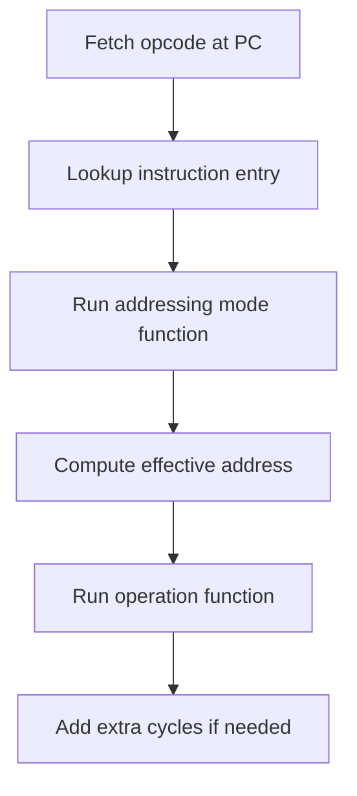

# 📌 6502 Addressing Modes (High-Level Overview)

The 6502 CPU supports multiple *addressing modes* which define **where an instruction reads/writes its operand**.

Each instruction consists of:

* **Opcode byte** (what to do)
* **0–2 operand bytes** (how to locate data)

Addressing modes are executed *before* the opcode logic, because they:

1. Advance the program counter correctly
2. Compute the effective address (stored in `addr_abs` or `addr_rel`)
3. Sometimes add an extra cycle (e.g. page boundary crossings)

---

## 🧠 Internal CPU fields used

Our implementation uses the classic OLC-style CPU state:

* `pc` — program counter
* `addr_abs` — computed 16-bit effective address
* `addr_rel` — signed 8-bit relative offset (stored as u16)
* `fetched` — cached operand value for some instructions

---

## Execution flow (opcode + addressing mode)



---

# Addressing modes implemented

## 1) Implied (`IMP`)

Used when the operand is implicit (no extra operand bytes).

Examples:

* `CLC`
* `TAX`
* `ASL A`

In our implementation, implied mode also sets:

* `fetched = a`

So accumulator-based instructions can reuse the same `fetch()` logic.

---

## 2) Immediate (`IMM`)

The operand is the next byte in memory.

Example:

```
LDA #$10
```

Machine code:

```
A9 10
```

Immediate mode sets:

* `addr_abs = pc`
* then increments `pc`

So the operation reads directly from that address.

---

## 3) Zero Page (`ZP0`)

Zero page uses an **8-bit address** in the range:

```
0x0000 .. 0x00FF
```

Example:

```
LDA $44
```

Machine code:

```
A5 44
```

Zero page is faster because it uses only one operand byte.

---

## 4) Zero Page + X (`ZPX`) and Zero Page + Y (`ZPY`)

These modes take the zero-page operand byte and add the X or Y register.

Example:

```
LDA $44, X
```

Machine code:

```
B5 44
```

Address calculation wraps around within zero page:

```
(0x00FF + 1) → 0x0000
```

---

## 5) Relative (`REL`)

Relative addressing is used for **branch instructions only**:

* `BEQ`, `BNE`, `BMI`, …

The operand is a signed 8-bit offset relative to `pc`.

Example:

```
BNE -4
```

The CPU sign-extends the offset into `addr_rel`.

Branch instructions later apply:

```
pc = pc + addr_rel
```

---

## 6) Absolute (`ABS`)

Absolute addressing reads a full 16-bit address (little-endian):

```
lo = mem[pc]
hi = mem[pc+1]
addr_abs = (hi << 8) | lo
```

Example:

```
LDA $1234
```

Machine code:

```
AD 34 12
```

---

## 7) Absolute + X (`ABX`) and Absolute + Y (`ABY`)

These modes compute:

```
addr_abs = base + X   (or + Y)
```

They may require an **extra cycle** if adding X/Y crosses a page boundary:

Example:

```
0x12FF + 1 = 0x1300
```

That page crossing is detected using:

```text
(base & 0xFF00) != (addr_abs & 0xFF00)
```

---

## 8) Indirect (`IND`) — used by `JMP`

Indirect addressing is a pointer lookup:

```
JMP ($1234)
```

Machine code:

```
6C 34 12
```

The operand (`$1234`) points to a memory location containing the real jump target.

### The 6502 JMP indirect bug

The original NMOS 6502 has a hardware bug:

```
JMP ($12FF)
```

will read the high byte from `$1200`, not `$1300`.

This is reproduced in our implementation for accuracy.

---

## 9) Indexed Indirect (`IZX`) — `($nn, X)`

This is a two-step pointer lookup:

Example:

```
LDA ($44, X)
```

Machine code:

```
A1 44
```

Steps:

```mermaid
flowchart TD
    A[Read operand byte t = mem[PC]] --> B[t = (t + X) & 0xFF]
    B --> C[lo = mem[t]]
    C --> D[hi = mem[(t+1)&0xFF]]
    D --> E[addr_abs = hi<<8 | lo]
```

This mode always wraps in zero page.

---

## 10) Indirect Indexed (`IZY`) — `($nn), Y`

Example:

```
LDA ($44), Y
```

Machine code:

```
B1 44
```

Steps:

```mermaid
flowchart TD
    A[Read operand byte t = mem[PC]] --> B[lo = mem[t]]
    B --> C[hi = mem[(t+1)&0xFF]]
    C --> D[base = hi<<8 | lo]
    D --> E[addr_abs = base + Y]
    E --> F[Add 1 cycle if page crossed]
```

This mode is the one that commonly triggers the extra cycle due to page crossings.

---

# Summary table

| Mode | Example       | Bytes | Notes                           |
| ---- | ------------- | ----- | ------------------------------- |
| IMP  | `CLC`         | 1     | No operand                      |
| IMM  | `LDA #$10`    | 2     | Operand is next byte            |
| ZP0  | `LDA $44`     | 2     | 0x0000–0x00FF                   |
| ZPX  | `LDA $44,X`   | 2     | Wraps in zero page              |
| ZPY  | `LDX $44,Y`   | 2     | Wraps in zero page              |
| REL  | `BNE label`   | 2     | Signed offset                   |
| ABS  | `LDA $1234`   | 3     | Full 16-bit address             |
| ABX  | `LDA $1234,X` | 3     | +1 cycle if page crossed        |
| ABY  | `LDA $1234,Y` | 3     | +1 cycle if page crossed        |
| IND  | `JMP ($1234)` | 3     | Includes JMP bug                |
| IZX  | `LDA ($44,X)` | 2     | Pointer in zero page            |
| IZY  | `LDA ($44),Y` | 2     | Pointer + Y, page-cross penalty |


# Final note: cycle adjustments

Addressing modes return:

* `0` if no extra cycle is needed
* `1` if a page boundary crossing occurred

This allows cycle-correct timing for many instructions.
